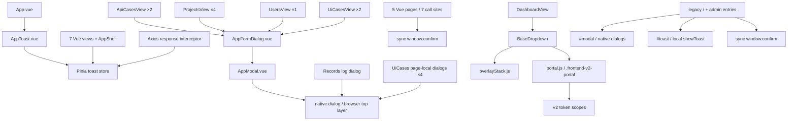

# Frontend V2 Phase 5.6A — Shared Overlay Contract Audit

## Status

**AUDIT PASS**

本阶段仅完成只读审计、合同冻结和 Phase 5.6B 提案。未修改生产代码、组件、Token、Validator、Router、Store、API 或业务页面，未开始 Phase 5.6B。

通过依据：Vue 与 legacy 两个运行时边界均已枚举；7 个 Vue 同步 Confirm 调用的返回值合同已明确；AppModal 可通过后续适配层保持现有 props/emits/slot；Portal Token 与 legacy 隔离边界明确；共享 AppModal 的焦点循环、Escape、焦点返回、Backdrop 与滚动行为已在真实浏览器确认；多套 Toast 的主合同可按入口确定。

## Git Baseline

- Branch：`codex/safe-refactor-preserve-features`
- HEAD：`a4c5764a759720707b34d65caddce7661d54e13d`
- Staged changes：`0`
- Working tree：`89` 个 status 条目，其中 `36` 个 tracked modified、`53` 个 untracked entries。
- 本报告创建前不存在。

工作区在本阶段开始前已混合以下既有改动：

- Frontend V2：AppFormDialog、AppShell、ApiCases、Dashboard、V2 Base Components、Overlay、Token、Component Lab、Validators、favicon、Vite 配置及既有 Phase Reports。
- payment amount regression：`app/data_scripts/payment_amount_regression/`、`static/payment-amount-regression.js` 及对应测试。
- system regression：后端 service/router、static JS/CSS 及对应测试。
- 其他 backend/static/test/docs：data scripts、projects/test records、agent、recovery、route contract、权限测试及实施文档。
- `docs/frontend-v2/` 整体相对当前 HEAD 为 untracked，因此 Git status 不会单独列出本报告。
- 审计进行期间另一个既有任务继续写入 system-regression 范围并生成 ignored `app/reports/allure-results`；status 条目数曾由 89 变为 90，且出现新的 system-regression 测试路径。该并发活动不在本阶段范围内，本阶段未覆盖或回退它。

本阶段未执行 `git add`、`reset`、`restore`、`checkout`、`clean`、`stash`、`commit` 或 `push`。

## Inventory

### Vue / Frontend V2 runtime

| 能力 | 当前实现 | 数量 / 状态 | 运行时归属 |
|---|---|---:|---|
| Shared Modal | `AppModal.vue` | 1 个共享组件 | native `<dialog>`，无 Teleport |
| Shared Form Dialog | `AppFormDialog.vue` | 9 个模板实例、4 个页面消费者 | 包装 AppModal |
| Page-local Dialog | Records 1 个；UiCases 4 个 | 5 个定义 | native `<dialog>` |
| Native dialog total | AppModal 1 + page-local 5 | 6 个定义，7 个 `showModal()` 调用点 | 浏览器 top layer |
| Confirm | bare `confirm()` | 7 个调用点 | 同步浏览器 API |
| Toast | `AppToast.vue` + Pinia `toast.js` | 1 个活动实例、60 个 `toast.show()` 调用点 | App 根组件，全路由共享 |
| Dormant legacy host | `frontend/index.html` 的 `#toast` 与 `#modal` | 各 1 个 | V2 入口未加载 `static/app.js`，无活动消费者 |
| Portal Host | `overlay/portal.js` | 运行时唯一 `.frontend-v2-portal` | 仅 owner 存在时挂到 body |
| Overlay Stack | `overlay/overlayStack.js` | 1 个模块 | 仅最小登记、同组互斥、顶层 Escape |
| Teleport | `BaseDropdown.vue` | 唯一使用点 | Dashboard production + Component Lab |
| Tooltip | `BaseTooltip.vue` | Component Lab only | 非 Portal、本地绝对定位 |
| Alert | `window.alert` | 0 | Not Applicable |
| Promise Confirm | 无 | 0 | Not Applicable |
| Callback Confirm | 无 | 0 | Not Applicable |
| Toast composable/event bus | 无 | 0 | Pinia store 是唯一 Vue 驱动方式 |
| Shared Loading Overlay | 无 | 0 | Loading 仅在具体按钮、Skeleton、slot 或 Dialog 内容中表达 |

### Legacy runtime boundary

legacy `/` 是独立 HTML/JS 入口：

- `static/index.html` 提供共享 `#toast` 和共享 native `#modal`。
- `static/app.js` 提供 `showToast(message)` 与 `openForm(...)`；Toast 为单例 2600ms，Modal 通过 `modalEl.innerHTML` 复用。
- 12 个文件共有 61 个 `.showModal()` 调用点；主要复用共享 `#modal`。
- `static/data-factory-agent.js` 另行按需创建 `#dataAgentLearningCenter` native dialog 并 append 到 body。
- `static/admin/templates.html` 是独立页面，拥有自己的 `#templateModal` 与 `#toast`。
- legacy 共 9 个真实同步 Confirm 调用点。
- 16 个 legacy 文件共有 317 个实际 `showToast(...)` / `options.showToast(...)` 调用；三个 `showToast` 定义未计入 317。

legacy 主入口、两个 admin 独立入口和 Vue V2 各自有可确定的 Toast 主合同，因此属于“多入口隔离实现”，不是无法归属的并行主合同。

## Consumer Matrix

| 消费者 | Modal / Dialog | Confirm | Toast | 关键合同 |
|---|---|---|---:|---|
| `ApiCasesView` | AppFormDialog ×2：CRUD、批量执行 | 删除 ×1 | 11 | 成功由页面关闭；失败保持打开；批量关闭后清 selection；无 dialog loading/close guard |
| `ProjectsView` | AppFormDialog ×4：项目、环境、测试账号、账号绑定 | 删除项目/环境/测试账号 ×3 | 15 | 各自持有 visible/editing/values；关闭重置对应状态；失败保持打开；无提交防重 |
| `UsersView` | AppFormDialog ×1：用户 CRUD | 删除用户 ×1 | 5 | 成功关闭并 reload；失败保持打开；关闭重置 form state |
| `UiCasesView` | AppFormDialog ×2；page-local native dialog ×4 | 删除用例 ×1 | 17 | 存在录制中 + 保存录制的真实嵌套 top-layer Dialog；执行表单与进度 Dialog 为顺序切换 |
| `DashboardView` | Not Applicable | Not Applicable | 1 | 生产 BaseDropdown 消费者；可能成为未来 Modal/Dropdown 层级回归页 |
| `RecordsView` | page-local 日志 native dialog ×1 | 再次执行 ×1 | 8 | 日志内容使用 `v-html`；无 `@close`，Escape 后 `logVisible` 会保持旧值 |
| Settings | Not Applicable | Not Applicable | Not Applicable | 当前 Vue Router 无 SettingsView/Settings route，不伪造消费者 |
| `LoginView` | Not Applicable | Not Applicable | 1 | AppToast 仍由 App 根渲染；登录错误走 API client + 页面 catch 路径 |
| `AppShell` | Not Applicable | Not Applicable | 1 | “全局 AI 配置”仅发 info Toast；退出不 Confirm |
| `api/client.js` | Not Applicable | Not Applicable | 1 | 非 401 错误先全局 Toast，再 reject `Error(detail)`；页面 catch 可能再次 Toast |
| `App.vue` | Not Applicable | Not Applicable | 全局挂载点 | AppToast 位于 AppShell/router-view 之前，路由切换不卸载 |
| Component Lab | BaseDropdown / BaseTooltip | Not Applicable | lab status 非 Toast | 仅开发验证，不是生产消费者 |
| legacy `/` | 共享 `#modal` + 动态 learning dialog | 7 个主入口调用 | 301 个调用 | 与 Vue 运行时隔离；不得由 Phase 5.6B 修改 |
| legacy admin pages | templates dialog；heal-logs 无 dialog | templates ×1 | 8 个调用 | 两个独立 HTML 页面各自维护 Toast；templates 自有 Modal |
| legacy `test-record-rerun.js` | 复用共享进度 Modal | 再次执行 ×1 | 5 | 独立于 Vue Records 的同类业务实现 |

### AppFormDialog shared consumers

AppFormDialog 当前有 9 个实例：ApiCases 2、Projects 4、Users 1、UiCases 2。所有实例共享以下 API：

- Props：`visible`、`title`、`fields`、`values`、`submitLabel`。
- Emits：`close`、`submit(payload)`。
- Slot：AppFormDialog 使用 AppModal 的 `#body`；调用页面本身不传 slot。
- Open：页面先写 title/values/editing，再置 `visible=true`。
- Initial values：每次 visible 变为 true 时按 `values[field.name] ?? field.default ?? ''` 重建 form。
- Close/reset：AppFormDialog 不自行 reset；页面 close handler 负责置 false，并按业务重置 editing/values。
- Submit：只 emit 浅拷贝，不 await 返回值、不读取返回值、不自动关闭。
- Submit success：调用页面 await API 后显式 close/reload。
- Submit failure：catch Toast，不关闭，保留输入。
- Loading/disabled：共享 AppModal 无 loading prop；共享提交按钮不 disabled。
- Promise/callback：页面 handler 可以 async，但 AppFormDialog 不等待其 Promise；没有 `return false` 合同。UiCases 中“return false 阻止自动关闭”的注释与真实实现不一致，真正保持/关闭仍由页面显式 state 控制。
- DOM dependencies：AppModal 依赖 `.modal/.modal-head/.modal-body/.modal-foot/.btn/.form-grid`；AppFormDialog 依赖 `.field/.form-grid`；页面不直接持有 AppModal ref。

## Modal Contract

### AppModal structure

- native `<dialog ref="dialogEl" class="modal" @close="onClose">`。
- 不使用 Teleport；挂在调用组件所在 Vue 树中，但 `showModal()` 后进入浏览器 top layer。
- Backdrop 由 legacy 全局 `.modal::backdrop` 提供；组件没有独立 backdrop DOM。
- 固定 header/body/footer 结构。
- 仅 `#body` slot；title 为字符串 prop；无 description contract；footer 固定为 submit button。
- Body 内再包一层 legacy `.form-grid`。

### AppModal open / close

- 受控状态名：`visible`。
- 无 `update:visible`；只 emit `close` 与 `submit`。
- watcher：visible true 时 `showModal()`；false 时 `dialog.close()`。
- Close button：只 emit `close`，依赖父组件把 visible 置 false。
- Native Escape：浏览器关闭 dialog，`close` event 再 emit `close`。
- Backdrop click：不关闭；浏览器实测点击 backdrop 后 `open=true`。
- 无独立 cancel event、close reason、loading guard、destructive guard。
- Close button 路径可能产生两次 `close` 通知：按钮先 emit，父组件置 false 后 watcher 调 `dialog.close()`，native close event 再 emit。当前所有 close handlers 均为幂等 state reset，但该可观察行为必须在后续适配审计中处理。

### AppModal lifecycle

- AppModal 不管理表单数据；AppFormDialog 在打开时注入初值。
- AppModal 不 reset；关闭/reset/reload 均由页面负责。
- 成功与失败关闭时机完全由页面 handler 决定。
- 失败后现有所有 AppFormDialog 业务均保持打开。
- reopen 时 AppFormDialog 会重新从 props values/defaults 建表，因此不依赖旧内部 form；前提是调用页面正确更新 values。

### Page-local native dialogs

| Dialog | Open/close state | Loading / disabled | Nested / failure / cleanup | 特殊依赖 |
|---|---|---|---|---|
| Records log | `logVisible` + `logDialog` ref；直接 `showModal/close` | 加载文案写入 body，无 close guard | API 失败仍显示 fallback；没有 `@close`，Escape 后 state 与 DOM 不一致 | `v-html=logBodyHtml`、`.modal`、ref、事件顺序 |
| Ui recording active | `recordVisible` + ref；`@close` 调 cancel | 无按钮 loading | Escape/native close 会触发取消服务端录制；与 save dialog 可同时 open | polling、服务端 session、副作用 close |
| Ui recording save | `recordSaveVisible` + ref | submit 在 `recordSaving` 时 disabled；返回/Escape 未禁用 | 打开时 recording dialog 仍 open，形成真实嵌套；失败保持打开 | 回到下层 recording dialog、双层 top layer |
| Ui execute form | `executeVisible` + ref | submit 在 `executeSubmitting` 时 disabled；close/Escape 仍可用 | 成功关闭并打开 visual dialog；失败保持打开 | 动态 runtime fields、账号模式 |
| Ui visual progress | `visualRun` + ref，宽度 96vw/max 1100px | 无通用 loading prop | close 停止 polling；可从 footer 跳 Records | polling、截图、执行状态、较宽布局 |

### Visual / layout

- AppModal scoped width `520px`、max-width `90vw`。
- scoped body max-height `60vh`、`overflow-y:auto`；全局 `.modal` 另有 viewport max-height 和 overflow hidden。
- scoped shadow 为 `0 8px 32px rgba(...)`，仍是非 V2 Token。
- Backdrop 由 legacy `--color-overlay` 提供。
- Footer 为单行 flex，无窄屏 stacking contract。
- 普通 page-local dialog 消费全局 legacy `.modal`；visual dialog 扩展至 `96vw / 1100px`。
- Modal 没有 CSS z-index；native top layer 决定最终层级。

## Confirm Contract

Vue Confirm 的唯一实现是同步浏览器 `confirm(message): boolean`。没有 title、可配置 labels、loading、disabled、Promise、callback 或组件 state；浏览器控制标题、确认/取消文本、焦点与关闭。

| 调用点 | Message / 用途 | Destructive | 返回值与异步行为 |
|---|---|---|---|
| ApiCases delete | `确认删除这条数据？` | 是 | false 立即 return；true 后 await DELETE；失败 Toast |
| Projects delete project | 含项目名并明确“级联删除相关数据” | 高 | 同步 Boolean gate；无请求中防重 |
| Projects delete environment | 含环境名 | 是 | 同上 |
| Projects delete test account | 含账号名 | 是 | 同上 |
| Users delete | 含 username | 是 | 同上 |
| UiCases delete | `确认删除这条数据？` | 是 | 同上 |
| Records rerun | 含 record id 与 sensitive hint | 敏感执行 | 先 await context，再同步 confirm；true 后 rerun；失败 Toast |

精确结论：所有 7 个 Vue 调用方都直接依赖同步 Boolean 返回值。将其直接替换为 Promise-based BaseConfirm 会把判断对象从 Boolean 变成 Promise，并导致逻辑错误；必须把每个调用方显式改为 `await`，因此属于高风险合同变化，不能在 Foundation 阶段顺手迁移。

同步浏览器 Confirm 打开期间阻塞页面 JS；用户确认后没有 per-action loading/disabled guard，故请求发出后仍可能再次点击触发第二次操作。异步失败发生时 Confirm 已关闭，仅通过 Toast 告知，不会恢复 Confirm。

legacy 另有 9 个同步调用，全部保留在 legacy 边界：templates 删除、generic delete、数据脚本软删除、购物车不足自动补货确认、录制流程删除、取消录制、payment amount regression、资金类 requirement rerun、test-record rerun。Phase 5.6B 不得触碰这些调用。

## Toast Contract

### Vue active contract

- 全局 Pinia store；AppToast 在 App 根组件渲染，公开/受保护路由均存在。
- 单例单消息，不是 queue/stack。
- `show(msg)` 直接替换 message、显示，并重置唯一 timer。
- 自动消失时间：2600ms。
- `hide()` 可被代码调用，但 UI 没有手动关闭按钮。
- 没有 success/error/warning/info type 字段；没有 icon、action、dedupe key 或 promise contract。
- 重复消息不会去重；新消息替换旧消息并重新计时。
- 路由切换后 store 与 AppToast 保留，当前 timer 继续；隐藏后 message 字符串不清空。
- AppToast 使用文本插值，不允许 HTML，不使用 `v-html`。
- 无 `aria-live`、`role=status` 或 `role=alert`，屏幕阅读器没有可靠公告合同。
- 没有 composable/event bus；主调用 API 为 `toast.show(message)`。

### Vue call-site semantics

当前 60 个调用在 store 层全部无类型。以下是按静态消息语义的审计分类；可能显示“成功/失败”的执行完成消息按 info 计，不虚构运行时 type：

| Consumer | Success | Error | Warning | Info | Total |
|---|---:|---:|---:|---:|---:|
| ApiCasesView | 3 | 5 | 1 | 2 | 11 |
| ProjectsView | 7 | 8 | 0 | 0 | 15 |
| UsersView | 2 | 3 | 0 | 0 | 5 |
| UiCasesView | 4 | 9 | 1 | 3 | 17 |
| RecordsView | 0 | 2 | 4 | 2 | 8 |
| DashboardView | 0 | 1 | 0 | 0 | 1 |
| LoginView | 0 | 1 | 0 | 0 | 1 |
| AppShell | 0 | 0 | 0 | 1 | 1 |
| API client | 0 | 1 | 0 | 0 | 1 |
| **Total** | **16** | **30** | **6** | **8** | **60** |

API error 并未形成单一展示责任：Axios interceptor 对所有非 401 错误先 `toast.show(detail)`，再 reject `new Error(detail)`；多数页面 catch 后再次 `toast.show(error.message)`。结果通常是同一文本快速替换并重置 timer，而非显示两条堆叠 Toast。401 路径负责清 token/跳登录，但仍经过当前 `toast.show(detail)` 代码段；导航可能使提示短暂显示或被后续页面行为覆盖。

### Legacy Toast boundary

- legacy main：共享 `#toast`、文本输出、2600ms、单 timer。
- templates/heal-logs：各自定义 local `showToast` 与本页 `#toast`。
- 317 个 legacy 调用分布于 16 个文件：app 150、requirement-pack 36、full-flow 21、case-generation 21、requirement-verification 19、data-factory-agent 18、requirement-verification-v2 8、problem-goods 8、api-harvester 7、data-agent-learning-center 6、templates 6、test-record-rerun 5、payment regression 5、system regression 4、heal-logs 2、ai-config 1。
- Vue V2 的 `frontend/index.html` 仍含 dormant `#toast`，但 V2 入口没有加载 `static/app.js`；活动实现是 AppToast + Pinia。后续迁移不得误把 dormant node 当第二个活动 Vue Toast。

## Accessibility Contract

| 项目 | 当前事实 | 证据 / 风险 |
|---|---|---|
| Dialog role | native `<dialog>` 在 accessibility tree 中隐式表现为 dialog | 源码没有显式 `role=dialog`，不应依赖手写 role 来判断现状 |
| Accessible name | 无 `aria-labelledby`、`aria-label`、`aria-describedby` | 浏览器 snapshot 中 dialog 没有可见 accessible name；heading 不是自动命名合同 |
| Initial focus | 共享 AppModal 实测初始 activeElement 为 DIALOG 本身 | 用户必须 Tab 才到关闭按钮/字段；没有 autofocus/initial-focus contract |
| Focus containment | native modal 实测 Tab 序列：关闭 → input → textarea → 保存 → BODY → 关闭；未进入 backdrop 后的可交互页面控件 | 浏览器 top-layer/inert 提供实际 containment，但循环中经过 BODY；没有项目级 focus trap 实现 |
| Shift+Tab | 由 native dialog 处理，项目无自定义代码 | 后续自定义 Portal Modal 必须单独验证反向循环 |
| Focus return | Escape 关闭共享 AppModal 后实测焦点回到“新增项目” trigger | 当前依赖浏览器 native behavior；程序化链式/嵌套关闭仍需逐场景验证 |
| Escape | native dialog 默认 close；AppModal/UiCases 用 close event 同步 state | Records 无 close handler，Escape 后 state stale；recording close 还会触发服务端取消 |
| Backdrop | 实测点击 backdrop 不关闭 | 与当前 AppModal 行为一致；未来 BaseModal 默认不能擅自改成 click-to-close |
| Scroll lock | 无 body/html overflow 操作；实测 Modal 打开时页面仍可从 `scrollY=0` 滚到 `371` | 当前没有 scroll lock；V2 Modal Foundation 若新增，属于明确的新基础行为，需验证 nested ref-count |
| Toast announcement | 无 live region / status / alert | 错误、成功、warning 均可能不被屏幕阅读器公告 |
| Confirm | 浏览器提供系统模态、键盘与焦点 | labels/title 不可由项目控制；迁移时必须重新建立语义与焦点合同 |
| Dropdown | role menu/menuitem、controlled open、完整键盘、Escape 后 focus return | 已冻结且进入 Dashboard production；Modal 改动不得回归 |

## Overlay Layering

### Current effective matrix

| Layer | 声明值 | 实际机制 | 结论 |
|---|---:|---|---|
| Shell base | `--v2-z-base: 0` | AppShell 多处使用 | 当前页面底层 |
| Shell sticky topbar/sidebar | `--v2-z-sticky: 10` | sticky | token 另保留 sidebar 20/topbar 30，但 AppShell 未消费 |
| Legacy requirement sticky rows | 3 / 4 | legacy CSS | 只在 legacy requirement UI；不属于 Vue BaseTable |
| BaseTable sticky | N/A | 无 sticky header | 无 overlay 层级 |
| Dropdown | `--v2-z-dropdown: 40` | fixed Teleport panel | normal document stacking context |
| Tooltip | `--v2-z-dropdown: 40` | local absolute element | 非 Portal，可能被 overflow/stacking context 裁剪 |
| Modal backdrop | V2 token reserve 50；当前无使用 | native `::backdrop` in top layer | 当前不受 V2 数值 z 控制 |
| Modal panel | V2 token reserve 60；当前无使用 | native top layer | 始终压住 normal document layers |
| Toast | legacy `--z-toast: 50` | fixed AppToast in normal document layer | native dialog/top-layer backdrop 可压住 Toast；V2 toast 70 token 尚未使用 |
| Confirm | N/A | browser UI | 在文档 overlay 系统之外 |
| Native BaseSelect popup | N/A | UA/native popup | 在 Dialog 内可由浏览器显示；不受 V2 z token 管理 |
| Loading overlay | N/A | 无共享实现 | 页面 loading 不构成统一层 |

关键结论：

- 当前 native Modal 会压住 BaseDropdown、BaseTooltip 和 AppToast，不是简单的 `60 > 40` 或 `70 > 60` 数值关系。
- Toast 的 V2 token 虽预留为 70，但活动 AppToast 消费 legacy `.toast` 的 50，且 normal stacking 无法越过 native top layer。
- `overlayStack` 的 capture-phase Escape listener会优先处理登记的 V2 overlay。若未来 Modal 与 Dropdown 同时存在而仍由 native dialog 管理，第一次 Escape 可能只关闭 Dropdown并 preventDefault，Modal 留在原位。Phase 5.6B 必须统一 stack 责任。
- UiCases 的 recording + save 是真实双 native top-layer Dialog；后打开的 save 在上层，关闭后返回仍打开的 recording。
- 当前生产 BaseSelect 是 native select，不创建额外 Portal；外部 select 在 Modal 打开时因 native modality不可交互。

## Teleport / Portal Analysis

- 唯一 Teleport 源码使用点是 BaseDropdown。
- `acquireV2Portal(ownerId)` 只在有 owner 时创建 `.frontend-v2-portal` 并 append 到 body。
- 同时只保留一个 managed portal；重复 managed portal 会合并子节点后删除，unmanaged 同名节点只移除保留 class，不删除外部 DOM。
- owner Set 归零时清空并删除 portal；BaseDropdown close/unmount 都 release。
- `tokens.foundation.css`、`tokens.semantic.css`、`tokens.component.css` 都以 `.frontend-v2, .frontend-v2-portal` 双作用域定义 Token；reset/base 同样覆盖 portal subtree。因此 Teleport 不会丢失 `--v2-*`。
- V2 Token 不挂在 `:root/html/body`。legacy `static/index.html` 不加载 V2 CSS，也不运行 Vue portal 模块；legacy 页面不会创建 `.frontend-v2-portal`，不会消费 V2 Token。
- Portal 当前职责仅为 Dropdown panel host；不提供 focus trap、scroll lock、inert、modal backdrop、dynamic z-index 或 toast queue。
- `overlayStack` 只维护内存顺序、同 group mutual close 与顶层 Escape；没有为 Modal 定义 non-mutual nested semantics。

## Existing V2 Component Comparison

| Resource | 状态 / API | Lab / Production | 与 AppModal/AppToast 差异 | 缺口 |
|---|---|---|---|---|
| BaseDropdown | 已冻结；controlled `open`、`update:open`、select、placement、outside、keyboard | Lab + Dashboard production | Teleport + stack；AppModal 是 native dialog | Modal nesting、focus trap、scroll lock 不在其职责内 |
| BaseDropdownItem | 已冻结 menuitem | Lab + Dashboard | N/A | N/A |
| BaseTooltip | 已冻结轻量 tooltip | Lab only | 无 Teleport/stack | collision、viewport avoidance、跨 overflow 不支持 |
| Portal host module | 已实现 owner lifecycle | Dropdown production | AppModal/AppToast 不使用 | modal/toast ownership尚未进入 |
| Overlay stack module | 最小实现 | Dropdown production | AppModal/Escape 不登记 | nested modal、focus scope、scroll lock、layer type 缺失 |
| Modal component tokens | 已预留 surface/overlay/border/radius/shadow/z | 无组件消费 | AppModal 仍读 legacy class/token和魔法 shadow | spacing、width、focus/scroll behavior 尚未冻结 |
| Toast component tokens | 已预留 surface/text/radius/shadow/z | 无组件消费 | AppToast 仍读 legacy `.toast` | type、live region、queue/dedupe、portal 尚未定义 |
| BaseModal / BaseDialog | 不存在 | N/A | 无可直接迁移的 V2 component | Phase 5.6B 目标 |
| BaseToast | 不存在 | N/A | 无可直接迁移的 V2 component | 后续独立阶段 |
| BaseConfirm | 不存在 | N/A | 现有为同步 browser API | 后续 foundation + async consumer migration |

## Dependency Graph

## Risks

### High

1. **Sync Confirm contract**：7 个 Vue 与 9 个 legacy 调用直接依赖同步 Boolean；不能直接替换成 Promise API。
2. **Native top layer 与 V2 z-index 不同体系**：当前 Toast/Dropdown/Tooltip 的 numeric z 无法越过 native Modal；未来混用会造成遮挡与 Escape 顺序冲突。
3. **AppModal blast radius**：修改 AppModal 会自然影响 AppFormDialog 的 9 个实例和 4 个页面；“AppFormDialog Overlay Integration”不能在 AppModal production replacement 之后再被视为独立接入动作。
4. **UiCases nested lifecycle**：recording/save 是真实嵌套；关闭 recording 还有服务端取消副作用。mutual-close overlay 策略会破坏业务。
5. **Records log contract**：日志依赖 `v-html`，且 Escape 后 state stale；不能在 BaseModal Foundation 中顺手迁移或净化内容。
6. **Toast duplicate path**：interceptor 与页面 catch 可能对同一错误调用两次，当前表现为替换/重计时。Toast queue 化会把隐藏的重复变成两条可见消息。

### Medium

1. AppModal 没有 accessible name/description contract，初始焦点落在 dialog container。
2. AppModal close button 路径可能双 emit close；当前 caller 幂等，但适配器必须明确处理。
3. 无 body scroll lock；自定义 Modal 引入 scroll lock 后必须支持嵌套 ref-count 和原 overflow 恢复。
4. Shared AppModal 无 loading/disabled，Projects/ApiCases/Users 的提交可能重复触发；本审计只记录，不把业务防重塞进 Foundation。
5. Ui record save/execute 只禁用 submit，Escape/close 仍可发生；后续不能擅自更改。
6. `frontend/index.html` 保留 dormant `#toast/#modal`，容易被静态扫描误判为活动第二实现；生产 V2 迁移不得复用或删除这些共享静态 DOM，除非另立批准阶段。
7. BaseTooltip 非 Portal；Modal Foundation 不得顺手改变 Tooltip 架构。
8. Handoff README/CURRENT-TASK 仍含 Phase 5.2B2 旧状态文字，与真实已完成代码/phase report 不一致；本审计以代码与 Git 状态为准。

## Recommended Migration Order

原建议顺序需要调整。`AppFormDialog -> AppModal` 是直接依赖；一旦 AppModal 被 production 替换，所有 AppFormDialog 已同时进入新 overlay，不能再把 AppFormDialog overlay 接入放在第 5 步。

推荐顺序：

1. **BaseModal / Modal Overlay Foundation**：Component Lab only；建立 Portal、stack、focus、scroll、ARIA、nested semantics，不接生产。
2. **AppModal Shared Integration + AppFormDialog regression**：只做 AppModal adapter 的一对一替换；同阶段回归全部 9 个 AppFormDialog 实例，但不修改 AppFormDialog API/业务 handler。
3. **BaseToast Foundation**：独立建立 presentational/ARIA/layering 合同，不改现有调用点。
4. **AppToast + Toast Store Integration**：保持单例/2600ms/文本合同；先不 queue 化，不在同阶段清理 60 个调用点或 API duplicate responsibility。
5. **Page-local Dialog migrations**：Records 单独一轮；UiCases recording/save 与 execute/visual 再分别实施，保留嵌套和 close side effects。
6. **BaseConfirm Foundation**：Component Lab only，明确 Promise API 与 destructive visual contract。
7. **Confirm consumer migrations**：按页面逐个把同步 Boolean 调用改为 `await`；每轮只迁一个业务域并保留 API/handler 顺序。legacy confirm 不进入 Vue 阶段。
8. **最终跨层回归**：Dropdown + Modal + Toast + native Select + nested Dialog + legacy isolation。

Toast 应早于 Confirm production migration：Confirm 的异步失败仍依赖 Toast，先冻结 Toast 能避免同一阶段同时改变确认与反馈两个核心合同。

## Phase 5.6B Proposal

### 阶段名称

**Phase 5.6B — BaseModal & Modal Overlay Foundation**

### 精确目标

只在 Component Lab 建立可复用 BaseModal 和 modal-capable overlay primitives。不得替换 AppModal，不得接入任何生产页面，不得实现 Confirm/Toast/Form framework。

建议冻结的 BaseModal 最小 API：

- Props：`open:Boolean`、`title:String`、`description:String`、`ariaLabel:String`、`closeOnEscape:Boolean=true`、`closeOnBackdrop:Boolean=false`。
- Emits：`update:open`、`close(reason)`；组件本身不持有第二份 open 状态。
- Slots：default body、footer；header 的 title/description/close 结构由 BaseModal 提供。
- Close reasons：`escape`、`backdrop`、`close-button`；不包含业务 submit/confirm 语义。
- Accessibility：`role=dialog`、`aria-modal=true`、generated labelledby/describedby；title 或 ariaLabel 至少一个有效。
- Focus：打开后 `[autofocus]` → 首个可聚焦项 → panel fallback；Tab/Shift+Tab trap；只允许顶层 modal trap；关闭后回到 opener。
- Overlay：Teleport 到唯一 `.frontend-v2-portal`；Modal group 允许 nested，不执行 Dropdown 式同组互斥；只有顶层响应 Escape/backdrop。
- Scroll：body scroll lock 使用 reference count；最后一个 modal 关闭时精确恢复原值。
- 默认 backdrop 不关闭，以保持 AppModal 现状；Phase 5.6B 只验证可配置能力。
- 不使用 native `<dialog>` top layer，以便 V2 `dropdown 40 < overlay 50 < modal 60 < toast 70` 成为同一 Portal stacking contract；因此必须由组件完整承担 aria、focus trap、inert-equivalent interaction block 与 scroll lock。

### 允许文件

- `frontend/src/components/v2/base/BaseModal.vue`（新建）
- `frontend/src/components/v2/base/index.js`
- `frontend/src/components/v2/overlay/overlayStack.js`
- `frontend/src/components/v2/overlay/portal.js`（仅 owner/nested Modal 兼容所需的最小修改）
- `frontend/src/components/v2/overlay/focusTrap.js`（如独立模块确有必要）
- `frontend/src/components/v2/overlay/scrollLock.js`（如独立模块确有必要）
- `frontend/src/styles/v2/tokens.component.css`（仅补 BaseModal 必需 `--v2-*` component tokens）
- `frontend/src/dev/V2BaseComponentsLab.vue`
- `frontend/scripts/validate-v2-support-components.mjs`（仅 export/Lab-only production boundary）
- `frontend/scripts/validate-v2-modal-foundation.mjs`（新建）
- Phase 5.6B report 与明确要求的 Component Lab screenshots

### 禁止文件

- `frontend/src/components/AppModal.vue`
- `frontend/src/components/AppFormDialog.vue`
- `frontend/src/components/AppToast.vue`
- `frontend/src/stores/toast.js`
- 所有 views、AppShell、App.vue、Router、Store、API、permission、CRUD、execute、batch execute
- `frontend/index.html`、legacy `static/**`、Prototype、migration config
- package.json、lockfile、dependencies、Vite base/input、FastAPI

### 允许能力

- BaseModal presentational structure
- controlled open/close request
- shared Portal
- modal overlay/panel layering
- nested modal stack semantics
- top-only Escape/backdrop
- focus trap/return
- reference-counted scroll lock
- ARIA naming/description
- cleanup of listener/timer/rAF/DOM ownership

### 禁止能力

- BaseConfirm、BaseToast、queue/store、form framework
- submit/business footer logic、destructive action policy、loading business state
- AppModal adapter、production usage
- Router/API/Store changes
- Dropdown/Tooltip redesign
- native dialog consumer migration

### 受保护合同

- BaseDropdown 的 controlled open、互斥、完整键盘、outside click、positioning、Portal lifecycle、focus return 全部保持。
- BaseTooltip 继续非 Portal。
- `.frontend-v2-portal` 唯一性、owner cleanup、Token 读取保持。
- Dashboard 是 Dropdown 唯一批准 production consumer。
- BaseModal 默认只允许 Component Lab，任何 production import 必须 FAIL。
- legacy `/` 的 V2 Token 与 Portal 数量保持 0。
- AppModal/AppFormDialog/Toast/Confirm 行为零变化。

### Validator

`frontend/scripts/validate-v2-modal-foundation.mjs`

### RED 条件

首次创建 validator 后必须因以下真实缺失而 RED：BaseModal 文件/导出/Lab 场景不存在；modal group/nested top semantics 不存在；focus trap/return、scroll lock、ARIA、backdrop close policy 与 cleanup 不存在。Supporting validator 仍应保持既有组件全部通过，不得因架构调整提前使 Modal validator GREEN。

### GREEN 条件

- BaseModal 真实导出且仅用于 Component Lab。
- 使用 Teleport 与唯一 shared portal，读取 `--v2-*`。
- controlled open，无内部镜像真相源。
- role/aria-modal/labelledby/describedby 正确；无 title 时 ariaLabel contract 生效。
- Tab/Shift+Tab、initial focus、focus return、top-only Escape 全部通过。
- backdrop 默认不关闭；开启时仅点击 backdrop 本身请求关闭。
- 两层 Modal 可嵌套；Escape 只关闭顶层；scroll lock 在最后一层关闭后恢复。
- Dropdown 与 Modal 同开时 stack 顺序确定，Escape 逐层关闭且无 listener 泄漏。
- close/unmount 后 portal owner、listener、timer、rAF、body style 无残留。
- 无 `v-html`、legacy class、magic color、third-party dependency、business import。
- validator self-check 能识别 production import、错误 Portal、缺 ARIA、缺 cleanup、错误 mutual-close、缺 focus/scroll、legacy class 与伪断言。

### Component Lab / Browser 验证页

- `/v3/dev/v2-base-components.html`
- 场景：default、long content、footer、no footer、title+description、ariaLabel fallback、default backdrop policy、opt-in backdrop close、Escape disabled、no focusable content、initial autofocus、two nested modals、Dropdown under/over modal interaction、open-state unmount、externally controlled open/close。
- Lab API request：0；Console error/warning：0；page error：0。

### 回归页面

- `/v3/dashboard`：Dropdown keyboard/Portal/focus return。
- `/v3/projects` 与 `/v3/api-cases`：现有 AppFormDialog 仍使用 native AppModal且行为不变。
- `/v3/records`：现有 log dialog smoke，不迁移。
- `/v3/ui-cases`：现有 page-local dialogs smoke，不迁移/不启动录制或执行。
- `/v3/login`、Shell refresh/logout smoke。
- legacy `/`：V2 Token 0、Portal 0、原 modal/toast 不变。

### Accessibility 验收

- role、aria-modal、name、description。
- initial focus、Tab/Shift+Tab loop、无 focusable fallback。
- nested top-only focus scope。
- Escape policy、focus return。
- background pointer/keyboard interaction不可达。
- 200% zoom 与 `prefers-reduced-motion`。

### Responsive 验收

- 1080 / 1240 / 1440 / 1920。
- narrow viewport：panel 不越界、body 可滚动、header/footer 可达、长文本不造成横向页面溢出。

### Console / Network 验收

- Component Lab Console 0 Error / 0 Warning / Page Error 0 / API request 0。
- production smoke 不增加 API 请求；不得用 console filter/ignore 绕过。

### 自动验证

- `node frontend/scripts/validate-v2-foundation.mjs`
- `node frontend/scripts/validate-login-redirect.mjs`
- `node frontend/scripts/validate-v2-base-components.mjs`
- `node frontend/scripts/validate-v2-support-components.mjs`
- `node frontend/scripts/validate-v2-dropdown.mjs`
- `node frontend/scripts/validate-v2-resource-foundation.mjs`
- `node frontend/scripts/validate-v2-api-cases-direct-mapping.mjs`
- `node frontend/scripts/validate-v2-api-cases-foundation-integration.mjs`
- `node frontend/scripts/validate-v2-favicon-static-asset.mjs`
- `node frontend/scripts/validate-v2-modal-foundation.mjs`
- `npm --prefix frontend run build`
- `git diff --check`

### Phase 5.6B BLOCKED 条件

- 必须修改任何禁止文件才能让 BaseModal 成立。
- Portal 不能同时保证唯一性、Token 读取与 Dropdown owner cleanup。
- nested modal、top-only Escape、focus scope 或 scroll-lock ref-count 无法稳定实现。
- BaseModal 出现在 production 页面或影响现有 AppModal。
- Dropdown/Tooltip contract、Dashboard production behavior 或 legacy isolation 回归。
- 需要新 dependency、全局 Token、body 永久 class/style 或 Router/API/Store 变更。
- 浏览器无法证明 focus return、background blocking、cleanup 或 Console/Network 标准。

## BLOCKED Conditions

| Phase 5.6A 条件 | 结果 | 证据 |
|---|---|---|
| 消费者无法完整枚举 | 未触发 | Vue 7 views、Shell、API client、shared components、legacy/static/admin 均交叉扫描 |
| 未理解同步 confirm | 未触发 | Vue 7 + legacy 9 的同步 Boolean gate 已定位并分类 |
| AppModal 无法一对一映射 | 未触发 | visible/title/submitLabel/body slot/close/submit 可由后续 adapter 保持；AppFormDialog regression 必须同阶段执行 |
| Teleport Token / legacy 隔离不明 | 未触发 | 双 token scope、runtime owner、legacy entry CSS/JS 边界明确 |
| focus trap / focus return 无法确认 | 未触发 | 真实浏览器确认 native focus containment、Tab loop、Escape return；同时确认缺少 scroll lock |
| 多套 Toast 主合同不明 | 未触发 | Vue active、Vue dormant、legacy main、admin local 各自归属明确 |
| shared overlay 影响未审计页 | 未触发 | Vue 全部当前路由与 legacy overlay 文件边界已扫描；Phase 5.6B 明确禁止 production 接入 |
| Git baseline 不可靠 | 未触发 | Branch/HEAD/staged/status 与 production tree hash 均记录 |

## Files Inspected

### Governance / planning / handoff

- `AGENTS.md`
- Phase 5.6A attached request
- `docs/frontend-v2/README.md`
- `docs/frontend-v2/handoff/CODEX-HANDOFF.md`
- `docs/frontend-v2/handoff/STATE.json`
- `docs/frontend-v2/handoff/CURRENT-TASK.md`
- `docs/migration/frontend-v2-vue-migration-plan.md`
- `docs/prototypes/frontend-v2-shell-prototype.html`
- relevant `docs/frontend-v2/phase-reports/**`

### Vue runtime / shared components

- `frontend/index.html`
- `frontend/src/main.js`
- `frontend/src/App.vue`
- `frontend/src/router/index.js`
- `frontend/src/api/client.js`
- `frontend/src/stores/toast.js`
- `frontend/src/components/AppModal.vue`
- `frontend/src/components/AppFormDialog.vue`
- `frontend/src/components/AppToast.vue`
- `frontend/src/components/AppShell.vue`
- all seven Vue view files: Login, Dashboard, ApiCases, Projects, Users, UiCases, Records

### V2 overlay / base / styles / validators

- `frontend/src/components/v2/overlay/portal.js`
- `frontend/src/components/v2/overlay/overlayStack.js`
- BaseDropdown, BaseDropdownItem, BaseTooltip, BaseSelect, BaseTable and base export index
- V2 foundation/semantic/component tokens, reset/base/index CSS
- Component Lab
- existing V2 foundation/base/support/dropdown/resource/API Cases/favicon validators

### Legacy boundary

- `static/index.html`
- `static/app.js`
- `static/design-tokens.css`
- `static/design-system-base.css`
- `static/styles.css`
- all static files containing `showModal`, `confirm`, `showToast`, `document.body`, focus, keydown/Escape, dialog/overlay semantics
- `static/data-factory-agent.js`、`data-agent-learning-center.js`、`test-record-rerun.js`、`test-record-report.js`
- requirement verification/pack, full-flow, case-generation, problem-goods, api-harvester, ai-config, payment/system regression
- `static/admin/templates.html`、`static/admin/heal-logs.html`

## No-Change Proof

- 报告创建前，对 `app/`、`frontend/src/`、`frontend/scripts/`、`frontend/dev/`、`frontend/index.html`、`frontend/vite.config.js`、`static/`（排除 `__pycache__`/`node_modules`）共 2221 个文件计算的 broad-tree SHA-256 为 `171e882dac9714bd4bf0c10a57fdbab34420b2ac99e6abc4bcf9242808a727b2`。
- 审计期间 broad tree 因其他 system-regression 工作和 `app/reports/allure-results` 生成而变为 2226 个文件、SHA-256 `40fb6ad56bf0310d0044844a2c55911e7e431a222e55beef7a1e74805d7d8924`。因此不把 broad-tree hash 相等性伪装成本阶段的 no-change 证据。
- 对本审计直接涉及的 43 个 Vue/Overlay/legacy 合同文件单独复核，完成时 manifest SHA-256 为 `f367bc14fba28911ee90228aa020370ee2017edc3b26c1c4a4c78ea241df7db9`；这些文件最新 mtime 为 `frontend/index.html` 的 `2026-07-30 14:53:14`，早于本阶段审计与报告写入，审计期间没有源文件写入。
- tracked `git diff --name-status` 仍为基线的 36 个既有路径，staged changes 仍为 0；没有新增本阶段生产路径。
- 浏览器只执行登录、GET 页面、打开/关闭“新增项目”Dialog、键盘/Backdrop/scroll 检查；未提交表单、未删除、未执行、未启动录制，未改变业务数据。
- 本阶段唯一写入为本报告。报告必需章节检查无缺失、trailing whitespace 为 0、`git diff --check` 退出码为 0；输出只有工作区既有文件的 LF/CRLF warning。

**AUDIT PASS**
